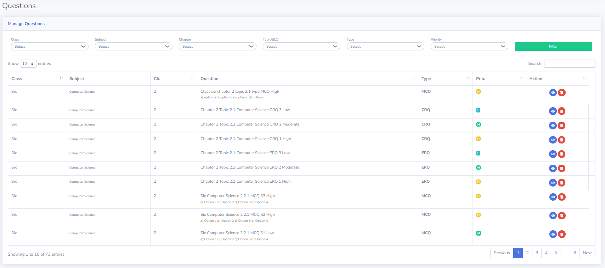
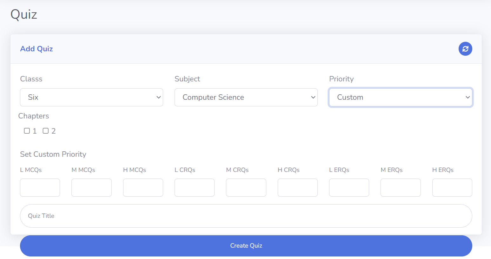
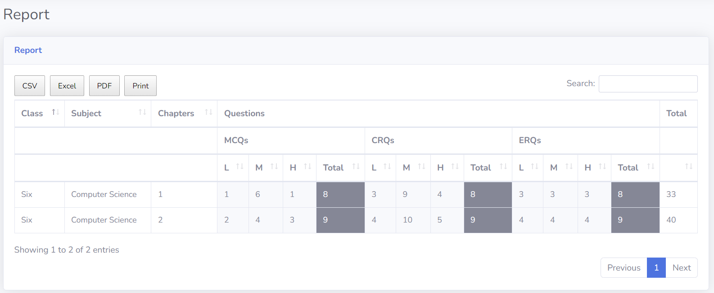

# Quiz Portal
> Generate quizzes by randomize questions.

This software provides a range of features to enhance quiz creation and management. Users can add classes and subjects to categorize their quizzes effectively. Additionally, they have the flexibility to set custom priorities for questions, ensuring specific topics are given more importance. The software also allows users to effortlessly generate quizzes based on their preferences. Finally, comprehensive reports enable users to track quiz performance and gain valuable insights for improvement.

# Features
* Add Classes
* Add Subjects
* Set Priority
  * Low
  * Moderate
  * High
  * Custom

# Functions
* Create Questions
* Manage Questions
  * Filter Questions
* Create Quiz

# Report
> Here you can see the summary.

# Snaps
> Mange Question Page

> Generate Quiz Page

> Report Page
